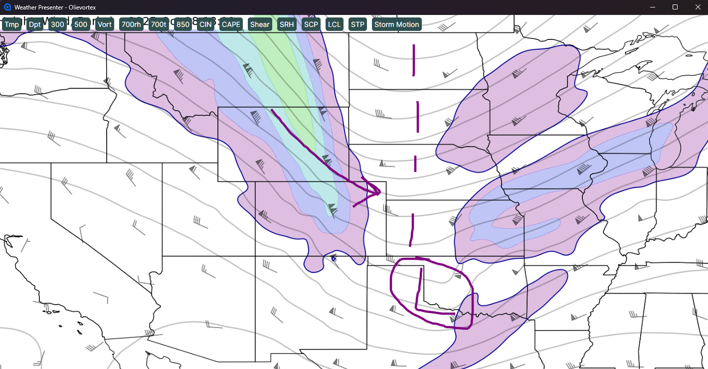

# Olie Weather Presenter
This is a proof-of-concept to learn [Avalonia UI](https://avaloniaui.net/) for .NET C#. Avalonia UI allows for cross-platform development, including MacOS and iOS and Android. Because it uses XAML, it feels nearly identical to developing with WPF.

The application allows a live-streamer to quickly navigate between weather maps, while panning the map and zooming in. The maps can be annotated, allowing lines to be drawn over the map. The lines remain when switching between weather maps, allowing better situational awareness.

# Operations
CTRL-O: Select an image folder. The files must be properly named. A sample_images folder is included with this project for demo purposes.

Buttons on top: Swtich between weather maps. Any annotations will persist.

Move mouse with CTRL key pressed: Drag the map

Mouse scroll wheel: Zoom

Drag mouse with button pressed: Draw on the map

SHIFT-X: Clear all lines

# .NET MAUI scarred my soul
If I could save just one soul, the pain I went through on this project will be worth it.

The original POC was developed using .NET MAUI. MAUI is the most buggy, frustrating framework I have ever had the displeasure of learning. I spent countless hours scouring Stack Overflow threads and GitHub issues for things that should have just worked.

Things that would work on MacOS would break on Windows and vice/versa. God forbid should you update NuGet packages, things that have worked before will inexcplicitly stop working.

I emplore you, if you want to do cross-platform deveopment, use Avalonia UI, Electron, or Flutter.

